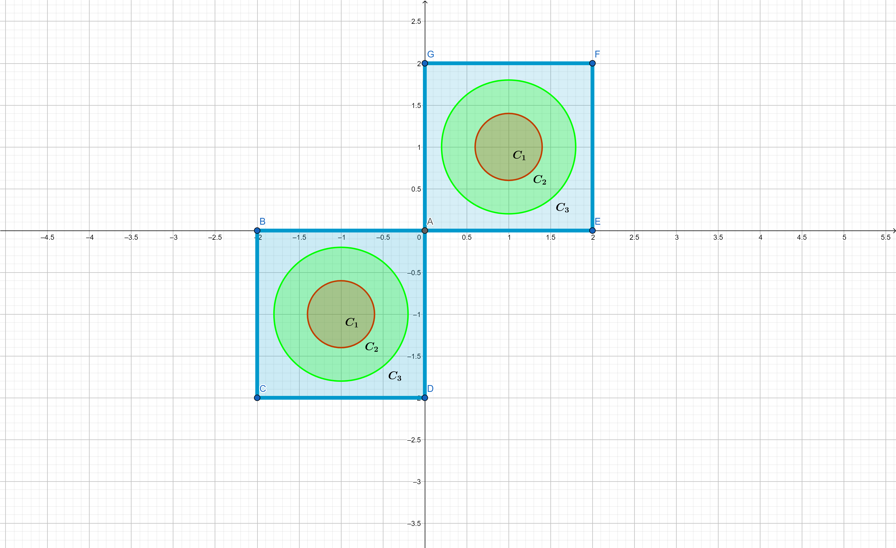
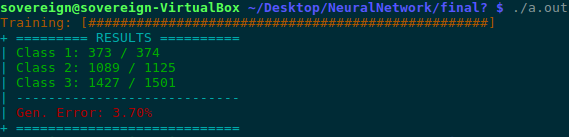
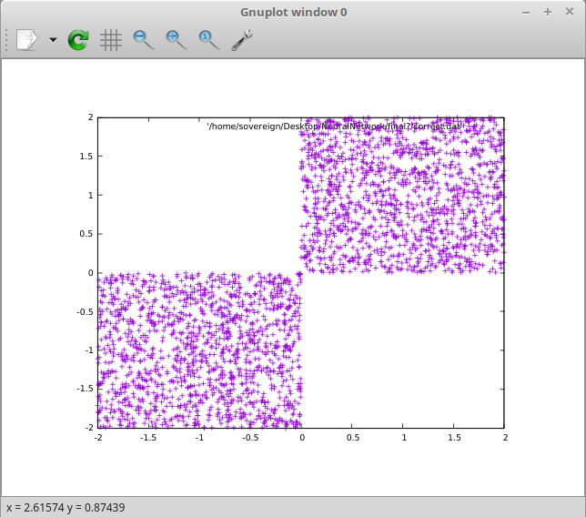
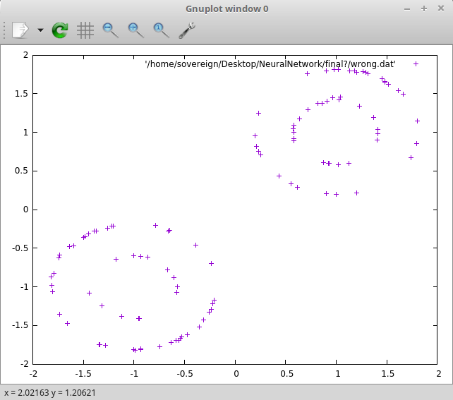
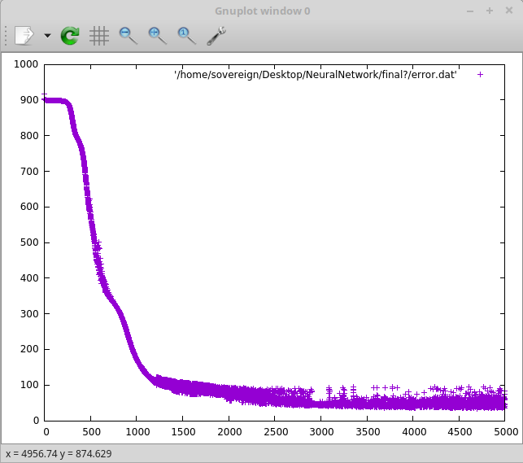

# Multilayer Perceptron Implementation

This was a project for the course MYE035-CSE.UOI - Computational Intelligence during the 2018-19 winter semester. 

**Created by:**
1. Nick Deligiannis
2. [Paschalis Homondozlis](https://github.com/pchomond)

## The problem

The mlp was used to solve a three class classification problem which is the following:

 >Given 6000 examples [points (x1,x2) at 2D space] in which:
 
* >3000 points are contained in the rectangle [0,2] x [0,2]   ( 1500 for training and 1500 for validation )

* >3000 points are contained in the rectangle [-2,0] x [-2,0] ( 1500 for training and 1500 for validation )

> Hence, there are two data sets. The training set and the testing/validation set. Finally we define the three classes/categories as following:

1. >
   
   >

2. >

   >

3. >
   
   >
 
 ### Visualisation

## Specifications 

This Neural Network has two hidden layers with customizable number of neurons in each one. The learning method implemented is 
gradient descent and the activation functions used are the logistic and the hyberbolic tangent.

## Known Issues

There is a problem using the hyperbolic tangent as activation function. If you select the tanh function then it is being asserted to all the neurons of the network,
including the output layer neurons, something that will not provide the proper results since tanh ranges from -1 to +1 and the encoding used was based on the logistic function
which ranges from 0 to 1.

## Usage

1. Generate the dataset using the "dataset_generation.c" file (compile /w gcc dataset_generation.c).
2. Change the path @ lines 752-754 (on mlp.c) or comment out those lines if you don't wish to use gnuplot for visualisation
3. Compile the "mlp.c" file (compile /w gcc mlp.c -lm)
4. Run the executable file.

## Example
### Results of a run.
 
### Visualisation in gnuplot 
#### Points classified correctly
 
#### Points classified wrong
 
#### Square error behavior
 

